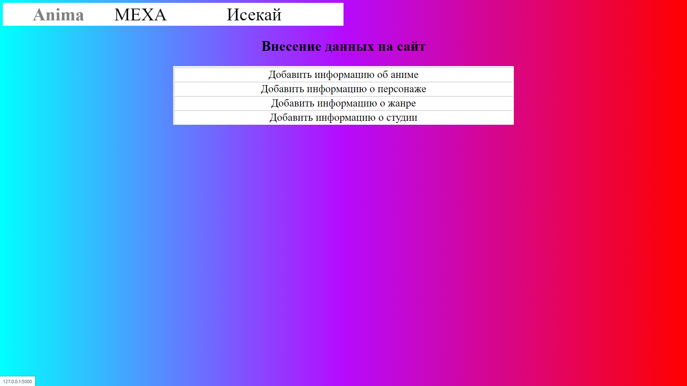
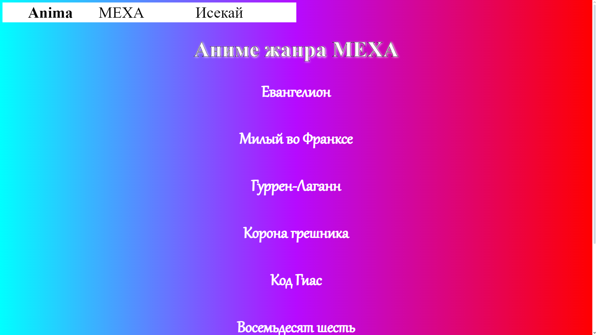
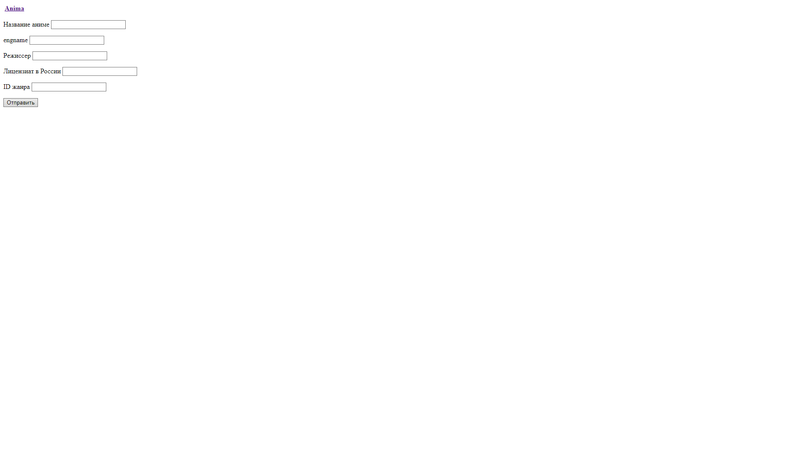

# Anima

Данный проект - информационный сайт.
Он содержит информацию об аниме-сериалах, а так же форму для добавления информации.

## Активация сайта

1. Скачать все файлы из репозитория.
2. Установить библиотеки, перечисленные в requirements.txt.
3. Запустить файл app.py

## Как работать
В шапке сайта содержатся ссылки:
1. Anima - ссылка на страницу со ссылками на формы для добавления новой информации (аудио и медиа файлы нельзя внести через форму).
2. Остальные ссылки - жанры аниме из базы данных, по ним можно перейти на страницы с ссылками на аниме выбранного жанра, перейдя по которым можно узнать информацию об аниме.

## Описание
1. Главная страница, в верхней части ссылки на списки аниме, ниже ссылки на формы для внесения данных на сайт

2. Страница содержит сслыки на все аниме определенного жанра, названия которых есть в базе данных

3. Каждая из страниц, посвященных определенному аниме состоит из таблицы, медиаплеера с оппенингом, и фотографиями персонажей с информацией о них

4. Одна из форм для добавления данных на сайт
